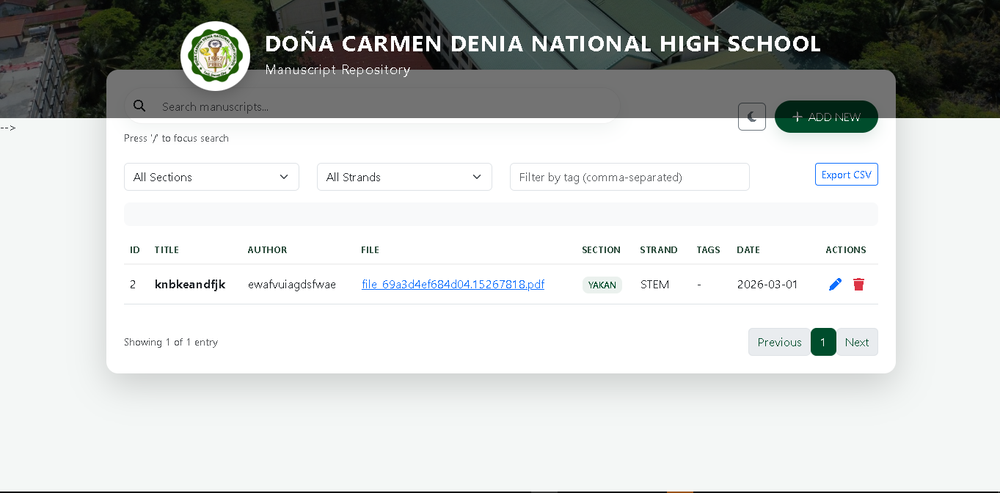
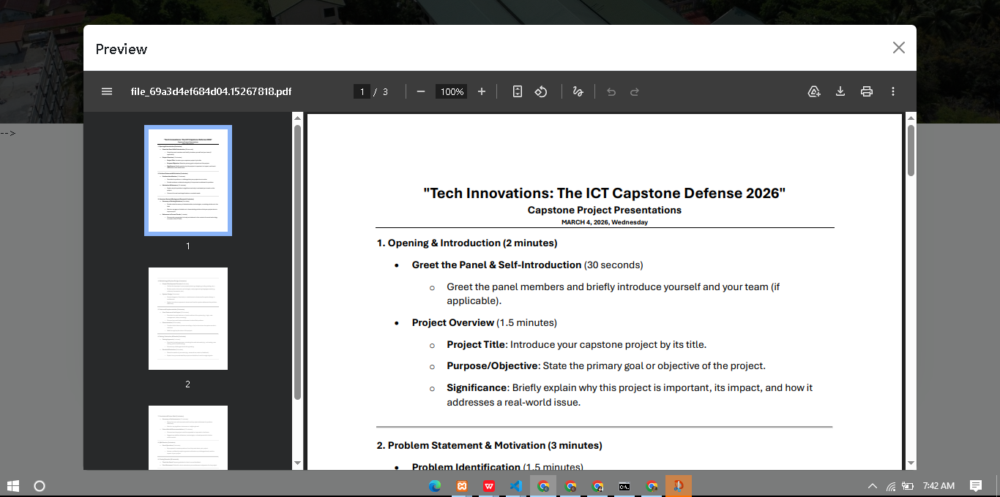

# **RESEARCHIVE: AN OFFLINE BASED INSTITUTIONAL RESEARCH REPOSITORY AT DCDNHS**
---

### DESCRIPTION:

ResearcHive is a centralized, offline institutional repository system specifically designed to manage and preserve the research manuscripts produced at DCDNHS. Developed using Java and MySQL, the system functions entirely without an internet connection to ensure that academic works remain accessible in environments with limited connectivity. Its primary goal is to replace traditional, inefficient physical storage methods with a digital archive that offers high-speed retrieval through a dedicated search bar. The platform supports the academic community by allowing students, teachers, and administrators to securely upload, categorize, and browse past research papers. By prioritizing data sovereignty and long-term digital preservation, the system serves as a sustainable solution for protecting the school’s intellectual history and fostering a stronger research culture.

### DASHBOARD

  

  

